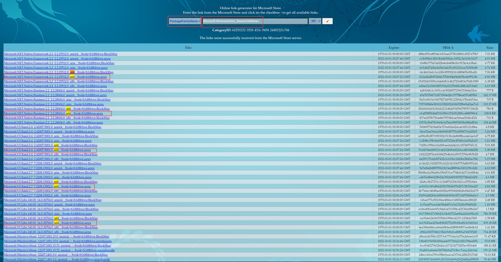

# Win10LTSC-Add-MicrosoftStore
Put all the files in the same folder, then run Powershell with administrator privileges and execute `Add-AppxPackage *`

## Another way

1. Open https://store.rg-adguard.net/
2. Choose `PackageFamilyName`, search `Microsoft.WindowsStore_8wekyb3d8bbwe`, and download 5 files.
3. 

4. Put all the files in the same folder, then run Powershell with administrator privileges and execute `Add-AppxPackage *`
